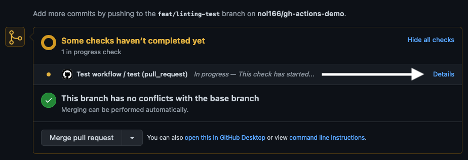
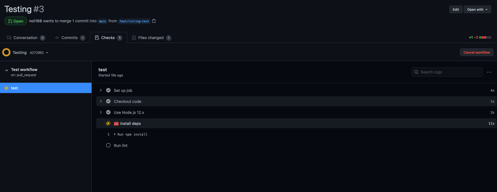
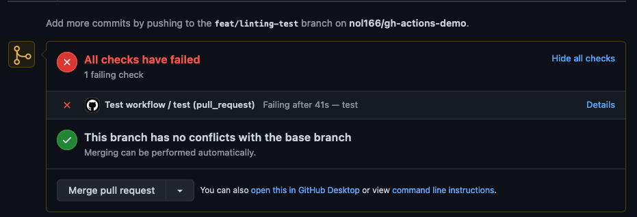

# GitHub Actions

# GitHub Actions: Linting Workflow with React and GitHub Actions

## Overview

GitHub Actions is a powerful feature for automating workflows directly in your repositories. Whether you're working solo or collaborating on a large project, GitHub Actions can streamline processes such as linting, testing, and deployment. This guide demonstrates how to set up a React project with a GitHub Actions workflow to run a linter automatically on every pull request, ensuring your code adheres to your team's standards.

## Key Features

- Automated linting for React applications on pull requests.
- Workflow triggered on pull requests to `main` and `dev` branches.
- Use of GitHub-hosted Ubuntu containers for job execution.
- Support for Node.js (v20.x) setup and dependency installation.
- Feedback integration directly into pull request checks.

## Concepts Covered

- Setting up a React application with ESLint for linting.
- Creating and configuring GitHub Actions workflows.
- Understanding YAML syntax for workflow definitions.
- Automating code quality checks during the pull request process.

## Installation and Usage

2. Install dependencies:

   ```sh
   npm install
   ```

3. Seed the application (if required):

   ```sh
   npm run seed
   ```

4. Start the development server:

   ```sh
   npm run develop
   ```

5. Add the GitHub Actions workflow for linting:
   - Create a `.github/workflows/main.yml` file and paste the YAML content provided below.
   - Commit and push your changes to the `main` branch.

## GitHub Actions Workflow

The workflow file (`.github/workflows/main.yml`) automates the following steps:

- Pull request triggers the workflow.
- The workflow spins up an Ubuntu container.
- Node.js (v20.x) is installed in the container.
- Project dependencies are installed.
- The `eslint` script runs, analyzing the code for errors.

Here is the YAML configuration for the workflow:

```yaml
# Name of workflow
name: Lint workflow

# Trigger workflow on pull requests to main and dev branches
on:
  pull_request:
    branches:
      - dev
      - main

# Define jobs
jobs:
  lint:
    # Specify the operating system
    runs-on: ubuntu-latest

    # Steps in the job
    steps:
      # Checkout the repository
      - name: Checkout code
        uses: actions/checkout@v4

      # Install Node.js
      - name: Use Node.js 20.x
        uses: actions/setup-node@v4
        with:
          node-version: 20.x

      # Install dependencies
      - name: Install dependencies
        run: npm install

      # Run linting
      - name: Run ESLint
        run: npm run lint
```

## Example Usage

### Triggering the Workflow

1. Create a feature branch:

   ```sh
   git checkout -b feature/lint-test
   ```

2. Add a linter error in `src/App.js`:

   ```js
   const App = 123;
   function App() { ... }
   ```

3. Commit and push the changes:

   ```sh
   git add .
   git commit -m "Test linting with intentional errors"
   git push origin feature/lint-test
   ```

4. Open a pull request to the `main` branch on GitHub.

### Viewing Workflow Results

- Navigate to the pull request on GitHub.
- View the "Checks" tab for detailed feedback on linting errors.
- Address the issues and push updates to the feature branch. The workflow will automatically rerun.

## Technologies Included

- **React**: Frontend framework for building user interfaces.
- **GitHub Actions**: Automation tool for CI/CD workflows.
- **ESLint**: Linter to enforce code quality standards.
- **Node.js**: JavaScript runtime environment for running tools and scripts.

## Summary

Integrating GitHub Actions into your project enables seamless automation of repetitive tasks like linting. This not only improves code quality but also enhances collaboration by catching issues early in the workflow. By following this guide, you now have a robust system to maintain clean, error-free code in your React projects.

## Resources

- [Introduction to GitHub Actions](https://docs.github.com/en/actions/learn-github-actions/introduction-to-github-actions)
- [ESLint Documentation](https://eslint.org/docs/latest/user-guide/getting-started)
- [GitHub Actions Workflow Syntax](https://docs.github.com/en/actions/using-workflows/workflow-syntax-for-github-actions)

GitHub Actions is a great solution to this problem. For example, you could create a GitHub action to automatically run a linter against every pull request to ensure the code meets your agreed upon standards. Today, we are going to create such an action.

- Before we begin, check out the [Introduction to GitHub Actions](https://docs.github.com/en/actions/learn-github-actions/introduction-to-github-actions) to get a grasp on some of the core concepts.

## Initial Project Setup

To begin, start by creating a boilerplate React application and putting it on Github. While you are probably already familiar with this process, let's go through it together.

1. In the command line, navigate to the desired parent folder and run `npm create vite`.

   - 🔑 _Note_: This command will automatically create a sub-folder which will house your React application; you do not need to perform a `mkdir` command to create one manually.

2. Enter the desired name of your new project folder.

3. From the first list of options, select your framework; for our activities in class, we'll be using `React`.

4. From the second list of options, select your variant; for our activities in class, we'll be using `JavaScript`.

5. Once the app has been created make sure to change into that directory.Additionally, let's add `eslint` as a dependency to our project:

   ```sh
   npm i eslint --save-dev
   ```

6. Open `package.json` and add a new script for linting called `eslint`:

   ```json
   "scripts": {
   "dev": "vite",
   "build": "vite build",
   "lint": "eslint src --ext js,jsx --report-unused-disable-directives --max-warnings 0",
   "preview": "vite preview",
   "eslint": "eslint src"
   },
   ```

7. Create a new repository on your personal GitHub and name it `gh-actions-demo` for consistency. Also, make sure to **not** initialize your repository with a `README.md` or `.gitignore`

8. Copy the first two lines of the snippet from GitHub for adding to an existing repo and paste it in the terminal:

   ```sh
   git remote add origin git@github.com:USERNAME/gh-actions-demo.git
   git branch -M main
   ```

9. Once we have added the remote to your local repository, we will add and commit all the files in the repository:

   ```sh
   git add -A
   git commit -m "Adding existing files"
   git push -u origin main
   ```

## Create the Workflow

Now that we have some code in our remote repository, let's create the workflow that will contain the actions we want to preform after each pull request.

1. In your terminal create a new directory called `.github`. GitHub will automatically look for this directory when it's pushed to your repository.

2. Create a `workflows` directory inside `.github`.

3. Finally, create a `main.yml` file inside your `workflows` directory

The folder structure should look something like this:

```md
.github
└── workflows
└── main.yml
```

## Actions

Our actions will be defined inside of our `main.yml` file. To begin, let's open up `main.yml` in our code editor. YAML is a recursive acronym that stands for "YAML Ain't Markup Language". YAML is human-readable syntax for data that is being stored or transmitted. Indentation and whitespace are important in YAML. Using spaces instead of tabs for indentation is encouraged.

- Note that the first part of this file simply gives a name to our workflow. The `on` portion specifies what should trigger the workflow. We also want our actions to run whenever someone creates a pull request to the `dev` or `main` branches.

- Next we specify the `jobs` that can run sequentially or in parallel. We are specifying that we want our job `test` to run on a container that uses Ubuntu as it's operating system. This container will be spun up by GitHub when our workflow is invoked.

- The `steps` section contains what actions or tasks we want to run on our container. In our case we are checking out the branch, using node v20, installing dependencies, and finally running our `eslint` script.

  ```yml
  #  Name of workflow
  name: Lint workflow
  # Trigger workflow on all pull requests
  on:
    pull_request:
      branches:
        - dev
        - main
  # Jobs to carry out
  jobs:
    test:
      # Operating system to run job on
      runs-on: ubuntu-latest
      # Steps in job
      steps:
        # Get code from repo
        - name: Checkout code
          uses: actions/checkout@v4
        # Install NodeJS
        - name: Use Node.js 20.x
          uses: actions/setup-node@v4
          with:
            node-version: 20.x
        # Build the app
        - name: 🧰 install deps
          run: npm install
        - name: Run lint
          run: npm run lint
  ```

- Save the content of the snippet above to your `main.yml` file, then add and commit all your files and push them to Github on the main branch

  ```sh
  git add .
  git commit -m "Add workflow"
  git push origin main
  ```

## Create a Pull Request

Now it's time to give our linter something to complain about! We will make some changes to our main `App` component and then create a pull request.

1. First let's make a new feature branch to create a pull request from:

   ```sh
   git checkout -b feat/linting-test
   ```

2. Open `src/App.js` and add another variable called `App` just before our functional component of the same name is declared

   ```js
   const App = 12
   function App() { ... }
   ```

3. Add and commit your changes, then push them to our `feat/linting-test` branch

   ```sh
   git add .
   git commit -m "Creating a PR for testing"
   git push origin feat/linting-test
   ```

4. Head to GitHub and click "Create pull request" next to the yellow indicator for our recent change to `feat/linting-test`.

   

5. Click "Create pull request" and then click on "details".

   

6. In this view we can see the output of our workflow

   

7. The PR should be automatically marked as having failed checks, indicating the author needs to refactor some of the code.

   

## Conclusion

Congratulations on getting some experience with GitHub actions! This is a very powerful feature that extends all the way into your CI/CD pipeline if you so choose to implement it. While you might not make use of it for every project, it can be especially useful for group projects or large organizations.
